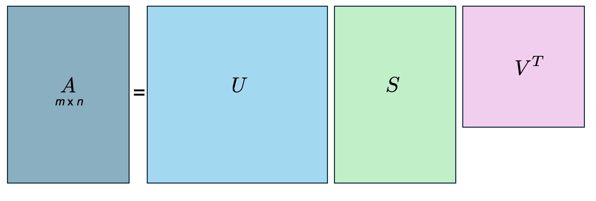

+++
title = "Singular Value Decomposition and PCA: Practical Foundations for Chemical Data"
date = 2025-11-19T10:00:00-08:00
draft = false
tags = ["linear-algebra", "SVD", "PCA", "data-analysis", "spectroscopy", "python"]
categories = ["fundamentals", "methods"]
summary = "A comprehensive guide to understanding and applying SVD and PCA for extracting meaningful structure from high-dimensional chemical datasets, with practical Python implementations."
+++

# Introduction

Modern chemistry produces high-dimensional datasets where the measured signals arise from a small number of chemically meaningful processes embedded in a much larger space of possible measurements. Structural biology experiments, time-resolved spectroscopy, ultrafast dynamics studies, and molecular simulations all generate data matrices where the challenge is to identify the directions of correlated variation, separate signal from noise, and extract physically interpretable components.

Linear algebra provides the mathematical framework for this task. Eigenvalue decomposition, singular value decomposition (SVD), and principal component analysis (PCA) reveal low-dimensional structure within high-dimensional measurements without requiring explicit knowledge of the underlying chemistry or kinetics. Instead, these methods rely on three key assumptions:

1. **Chemical processes produce coherent, correlated changes** in the data
2. **Noise is incoherent** and therefore distributed across many directions
3. **Linear superposition is valid** for spectroscopic or structural signals

Under these assumptions, the dominant eigenvectors or singular vectors extract the chemically meaningful subspace.

These decompositions offer model-independent insight. Eigenvalue decomposition identifies the intrinsic directions along which a linear operator acts. SVD generalizes this to any rectangular dataset. PCA provides a statistically optimal low-dimensional representation via variance maximization. Together, these tools allow us to identify components, quantify their contributions, and build mechanistic hypotheses grounded in the linear algebraic structure of the data.

# Eigenvalue Decomposition: The Foundation

For a square matrix $A \in \mathbb{R}^{n \times n}$, an eigenvalue $\lambda$ and eigenvector $\mathbf{x}$ satisfy:

<div>
$$A \mathbf{x} = \lambda \mathbf{x}$$
</div>

If $A$ is diagonalizable, then:

<div>
$$A = V \Lambda V^{-1}$$
</div>

where:
- $V = [\mathbf{x}_1 \ \mathbf{x}_2 \ \cdots \ \mathbf{x}_n]$ contains eigenvectors
- $\Lambda = \mathrm{diag}(\lambda_1, \dots, \lambda_n)$ contains eigenvalues

Eigenvalue decomposition identifies the "natural" coordinate system of the operator $A$: directions in which the transformation reduces to simple scaling. This structure informs the mathematics of SVD and PCA.


*Conceptual illustration of eigenvalue decomposition for a square operator $A$. The transformation $A\vec{x} = \lambda \vec{x}$ identifies special directions $\vec{x}_i$ (eigenvectors) that are simply scaled by the corresponding eigenvalues $\lambda_i$. Diagonalizing $A$ via its eigenvalues and eigenvectors reveals the natural coordinate system in which the action of the operator is decoupled.*

## Python Example: Eigenvalue Decomposition

Let's visualize eigenvalue decomposition with a simple 2D transformation:

<details>
<summary><strong>Click to show/hide Python code</strong></summary>

```python
import numpy as np
import matplotlib.pyplot as plt

# Define a 2x2 transformation matrix
A = np.array([[3, 1],
              [1, 2]])

# Compute eigenvalues and eigenvectors
eigenvalues, eigenvectors = np.linalg.eig(A)

# Create grid of points
theta = np.linspace(0, 2*np.pi, 100)
circle = np.array([np.cos(theta), np.sin(theta)])

# Transform the circle
ellipse = A @ circle

# Create visualization
fig, (ax1, ax2) = plt.subplots(1, 2, figsize=(12, 5))

# Plot 1: Original space with eigenvectors
ax1.plot(circle[0], circle[1], 'b-', alpha=0.5, linewidth=2, label='Unit Circle')
ax1.arrow(0, 0, eigenvectors[0, 0], eigenvectors[1, 0], 
         head_width=0.1, head_length=0.1, fc='red', ec='red', linewidth=2)
ax1.arrow(0, 0, eigenvectors[0, 1], eigenvectors[1, 1], 
         head_width=0.1, head_length=0.1, fc='green', ec='green', linewidth=2)
ax1.set_xlim(-2, 2)
ax1.set_ylim(-2, 2)
ax1.set_aspect('equal')
ax1.grid(True, alpha=0.3)
ax1.set_title('Original Space with Eigenvectors', fontsize=12, fontweight='bold')
ax1.legend([f'Unit Circle', 
           f'$\\mathbf{{v}}_1$ (λ={eigenvalues[0]:.2f})',
           f'$\\mathbf{{v}}_2$ (λ={eigenvalues[1]:.2f})'], fontsize=9)

# Plot 2: Transformed space
ax2.plot(ellipse[0], ellipse[1], 'r-', alpha=0.5, linewidth=2, label='Transformed')
ax2.arrow(0, 0, eigenvalues[0]*eigenvectors[0, 0], eigenvalues[0]*eigenvectors[1, 0],
         head_width=0.15, head_length=0.15, fc='red', ec='red', linewidth=2)
ax2.arrow(0, 0, eigenvalues[1]*eigenvectors[0, 1], eigenvalues[1]*eigenvectors[1, 1],
         head_width=0.15, head_length=0.15, fc='green', ec='green', linewidth=2)
ax2.set_xlim(-4, 4)
ax2.set_ylim(-4, 4)
ax2.set_aspect('equal')
ax2.grid(True, alpha=0.3)
ax2.set_title('Transformed Space', fontsize=12, fontweight='bold')
ax2.legend(['Ellipse (A·circle)', 
           f'λ$_1$·$\\mathbf{{v}}_1$ = {eigenvalues[0]:.2f}·$\\mathbf{{v}}_1$',
           f'λ$_2$·$\\mathbf{{v}}_2$ = {eigenvalues[1]:.2f}·$\\mathbf{{v}}_2$'], fontsize=9)

plt.tight_layout()
plt.savefig('content/ground-state/svd-pca-foundations/eigenvalue-demo.png', 
            dpi=200, bbox_inches='tight')
plt.show()

print("Eigenvalues:", eigenvalues)
print("\nEigenvectors:")
print(eigenvectors)
```

</details>

# Singular Value Decomposition: The Generalization

Let $A \in \mathbb{R}^{m \times n}$ be any (possibly rectangular) matrix. The full SVD expresses $A$ as:

<div>
$$A = U S V^{T}$$
</div>

where:
- $U \in \mathbb{R}^{m \times m}$ is orthonormal (left singular vectors)
- $V \in \mathbb{R}^{n \times n}$ is orthonormal (right singular vectors)
- $S \in \mathbb{R}^{m \times n}$ is diagonal (rectangular) with entries $s_1 \ge s_2 \ge \cdots \ge 0$ (singular values)


*Schematic representation of the full singular value decomposition. Any $m \times n$ matrix $A$ can be factored into the product $A = U S V^{T}$, where $U$ and $V$ are orthonormal matrices containing the left and right singular vectors, respectively, and $S$ contains the singular values. This decomposition expresses the linear transformation encoded in $A$ as a rotation, scaling, and a second rotation.*

## Connection to Eigenvalues

The matrices $AA^T$ and $A^T A$ connect full SVD to eigenvalue theory:

<div>
$$AA^T = U S S^{T} U^{T}, \qquad A^{T}A = V S^{T} S V^{T}$$
</div>

Thus:

<div>
$$A^{T}A \mathbf{v}_i = s_i^{2} \mathbf{v}_i$$
</div>

This means **singular values are the square roots of the eigenvalues of** $A^T A$.

## Interpretation of SVD Components

- **$U$**: Orthonormal basis in the $m$-dimensional measurement space (e.g., "spectral space" in energy-resolved experiments)
- **$S$**: Strengths of each component (singular values quantify contribution)
- **$V^{T}$**: Orthonormal basis in the $n$-dimensional condition space (e.g., "time" or "experimental coordinate" space)

## Why SVD Matters for Spectroscopy

SVD is especially powerful for time-resolved spectroscopic experiments such as TR-XES, TR-XAS, or ultrafast optical spectroscopy. These produce energy-vs-time maps where:

- One axis corresponds to energy (or wavelength)
- The other axis corresponds to delay time
- The raw data contain a mixture of meaningful signal, overlapping spectral contributions from multiple transient species, and substantial noise

SVD decomposes this matrix into orthogonal spectral and temporal components, allowing us to:

1. **Assess the dimensionality** of the dataset quickly
2. **Identify dominant time-dependent processes**
3. **Determine whether clean kinetic behavior is present** before further modeling

Practically, SVD acts as an immediate diagnostic tool: it reveals whether we have captured real dynamical evolution, whether additional species or states participate in the reaction, and whether the data quality supports deeper kinetic or spectroscopic analysis.

# From Full SVD to Thin SVD

Although full SVD is mathematically complete, experimental data almost always satisfy $m \gg n$, meaning only the first $n$ singular values can be nonzero.

Thus we can truncate:

<div>
$$U = [\mathbf{u}_1 \ \mathbf{u}_2 \ \cdots \ \mathbf{u}_n] \in \mathbb{R}^{m \times n}$$
</div>

<div>
$$S_n = \begin{pmatrix}
s_1 & & 0 \\
& \ddots & \\
0 & & s_n
\end{pmatrix} \in \mathbb{R}^{n \times n}$$
</div>

This yields the **thin SVD**:

<div>
$$A = U_n \, S_n \, V^{T}$$
</div>

In the context of spectroscopy:

<div>
$$A_{m \times n} = \underbrace{U_{m \times n}}_{\text{spectral modes}} \; \underbrace{S_{n \times n}}_{\text{singular values}} \; \underbrace{V^{T}_{n \times n}}_{\text{temporal modes}}$$
</div>

Columns of $A$ are denoted $A = [a_1 \ a_2 \ \cdots \ a_n]$, and the decomposition gives:

<div>
$$a_j = \sum_{i=1}^{n} s_i \, \mathbf{u}_i\, v_{ij}$$
</div>


*Thin singular value decomposition for a data matrix $A \in \mathbb{R}^{m \times n}$. Here $A$ is decomposed as $A = U_n S_n V^{T}$, where the columns of $U_n$ ($u_1, u_2, \dots, u_n$) represent orthonormal basis functions in the measurement space, $S_n$ contains the nonzero singular values, and the rows of $V^{T}$ ($v_1, v_2, \dots, v_n$) encode the amplitudes or time dependences of each component.*

## Python Example: SVD of Synthetic Spectroscopic Data

Let's create synthetic time-resolved spectroscopic data with two species:

<details>
<summary><strong>Click to show/hide Python code</strong></summary>

```python
import numpy as np
import matplotlib.pyplot as plt
from scipy.signal import gaussian

# Simulation parameters
n_energies = 200  # Energy points (measurement space)
n_times = 50      # Time points (condition space)
energies = np.linspace(7100, 7200, n_energies)  # eV
times = np.linspace(0, 100, n_times)  # ps

# Create two Gaussian spectral features (two chemical species)
def gaussian_peak(x, center, width, amplitude):
    return amplitude * np.exp(-((x - center) ** 2) / (2 * width ** 2))

# Species 1: Ground state depleting
spectrum1 = gaussian_peak(energies, 7130, 5, 1.0)

# Species 2: Excited state forming then decaying
spectrum2 = gaussian_peak(energies, 7155, 8, 0.8)

# Kinetics: A -> B -> C (ground state depletion and recovery)
k1 = 0.1  # ps^-1 (formation)
k2 = 0.02  # ps^-1 (decay)

# Time-dependent concentrations
conc1 = np.exp(-k1 * times)  # Species 1 depletes
conc2 = (k1 / (k2 - k1)) * (np.exp(-k1 * times) - np.exp(-k2 * times))  # Species 2 rises and falls

# Construct data matrix: outer product of spectra and concentrations
A_true = np.outer(spectrum1, -conc1) + np.outer(spectrum2, conc2)

# Add realistic noise
noise_level = 0.05
noise = noise_level * np.random.randn(n_energies, n_times)
A_noisy = A_true + noise

# Perform SVD
U, s, Vt = np.linalg.svd(A_noisy, full_matrices=False)

# Reconstruction with top k components
k = 3  # Number of components to keep
A_reconstructed = U[:, :k] @ np.diag(s[:k]) @ Vt[:k, :]

# Create comprehensive visualization
fig = plt.figure(figsize=(14, 10))
gs = fig.add_gridspec(3, 3, hspace=0.3, wspace=0.4)

# Plot 1: Original noisy data
ax1 = fig.add_subplot(gs[0, 0])
im1 = ax1.imshow(A_noisy, aspect='auto', origin='lower', cmap='RdBu_r',
                 extent=[times[0], times[-1], energies[0], energies[-1]])
ax1.set_xlabel('Time (ps)', fontsize=9)
ax1.set_ylabel('Energy (eV)', fontsize=9)
ax1.set_title('Raw Data (Signal + Noise)', fontsize=10, fontweight='bold')
plt.colorbar(im1, ax=ax1, label='ΔA (a.u.)')

# Plot 2: Reconstructed data (top 3 components)
ax2 = fig.add_subplot(gs[0, 1])
im2 = ax2.imshow(A_reconstructed, aspect='auto', origin='lower', cmap='RdBu_r',
                 extent=[times[0], times[-1], energies[0], energies[-1]])
ax2.set_xlabel('Time (ps)', fontsize=9)
ax2.set_ylabel('Energy (eV)', fontsize=9)
ax2.set_title(f'SVD Reconstruction (k={k})', fontsize=10, fontweight='bold')
plt.colorbar(im2, ax=ax2, label='ΔA (a.u.)')

# Plot 3: Singular value spectrum
ax3 = fig.add_subplot(gs[0, 2])
ax3.semilogy(range(1, len(s[:15])+1), s[:15], 'o-', linewidth=2, markersize=6)
ax3.axvline(k, color='r', linestyle='--', label=f'Truncation at k={k}')
ax3.set_xlabel('Component Index', fontsize=9)
ax3.set_ylabel('Singular Value', fontsize=9)
ax3.set_title('Singular Value Spectrum', fontsize=10, fontweight='bold')
ax3.grid(True, alpha=0.3)
ax3.legend(fontsize=8)

# Plot 4-6: First three spectral components (left singular vectors)
for i in range(3):
    ax = fig.add_subplot(gs[1, i])
    ax.plot(energies, U[:, i], linewidth=2)
    ax.set_xlabel('Energy (eV)', fontsize=9)
    ax.set_ylabel(f'$u_{i+1}$ Amplitude', fontsize=9)
    ax.set_title(f'Spectral Component {i+1} (s={s[i]:.3f})', 
                fontsize=10, fontweight='bold')
    ax.grid(True, alpha=0.3)
    ax.axhline(0, color='k', linestyle='-', linewidth=0.5)

# Plot 7-9: First three temporal components (right singular vectors)
for i in range(3):
    ax = fig.add_subplot(gs[2, i])
    ax.plot(times, Vt[i, :], linewidth=2)
    ax.set_xlabel('Time (ps)', fontsize=9)
    ax.set_ylabel(f'$v_{i+1}$ Amplitude', fontsize=9)
    ax.set_title(f'Temporal Component {i+1}', fontsize=10, fontweight='bold')
    ax.grid(True, alpha=0.3)
    ax.axhline(0, color='k', linestyle='-', linewidth=0.5)

plt.suptitle('SVD Analysis of Synthetic Time-Resolved Spectroscopy Data', 
            fontsize=12, fontweight='bold', y=0.995)
plt.savefig('content/ground-state/svd-pca-foundations/svd-spectroscopy-demo.png', 
            dpi=200, bbox_inches='tight')
plt.show()

# Print statistics
print("="*60)
print("SVD ANALYSIS SUMMARY")
print("="*60)
print(f"Data dimensions: {n_energies} energies × {n_times} time points")
print(f"Noise level: {noise_level:.3f}")
print(f"\nTop 5 singular values:")
for i in range(5):
    variance_explained = (s[i]**2 / np.sum(s**2)) * 100
    print(f"  s_{i+1} = {s[i]:.4f} ({variance_explained:.2f}% of variance)")
print(f"\nReconstruction with k={k} components:")
print(f"  Retained variance: {(np.sum(s[:k]**2) / np.sum(s**2)) * 100:.2f}%")
print(f"  Reconstruction error: {np.linalg.norm(A_noisy - A_reconstructed) / np.linalg.norm(A_noisy) * 100:.2f}%")
print("="*60)
```

</details>


*Application of thin SVD to a two-dimensional stopped-flow spectroscopic dataset $A_{m \times n}$ (wavelength vs. pump-probe delay). The matrix is decomposed into spectral basis vectors $u_1, u_2, \dots$, singular values $s_i$, and temporal components $v_i$. The left singular vectors describe orthogonal spectral signatures, while the right singular vectors capture their corresponding time evolutions.*

# Low-Rank Approximation: The Power of Dimensionality Reduction

The low-rank approximation from SVD is particularly important for chemical systems because **the number of chemically meaningful species is almost always far smaller than the number of measured points**. Even though a dataset may contain hundreds of energy channels and dozens of time delays, the underlying system might involve only two or three intermediates.

SVD provides the expansion:

<div>
$$A = \sum_{i=1}^{r} s_i \, \mathbf{u}_i \, \mathbf{v}_i^{T}$$
</div>

where $r = \mathrm{rank}(A)$.

The best rank-$k$ approximation (in the least-squares sense) is:

<div>
$$A_k = \sum_{i=1}^{k} s_i \, \mathbf{u}_i \, \mathbf{v}_i^{T}$$
</div>

This is fundamental for:
- **Denoising**: Large $s_i$ correspond to coherent signal; small $s_i$ usually reflect noise
- **Model reduction**: Perform kinetic modeling in reduced space where each component corresponds approximately to a chemical species
- **Compression**: Store and analyze only the top $k$ components

SVD exploits the structure by concentrating chemically meaningful information into the first few singular components, while higher-order components tend to correspond to noise or minor experimental artifacts. This bridges the gap between high-dimensional experimental measurements and the low-dimensional mechanistic space in which the chemistry actually occurs.

## Python Example: Denoising with Low-Rank Approximation

<details>
<summary><strong>Click to show/hide Python code</strong></summary>

```python
import numpy as np
import matplotlib.pyplot as plt

# Create synthetic image-like data
x = np.linspace(-3, 3, 100)
y = np.linspace(-3, 3, 100)
X, Y = np.meshgrid(x, y)

# True signal: combination of 2D Gaussians (low-rank structure)
signal = (np.exp(-(X**2 + Y**2)) + 
         0.5 * np.exp(-((X-1)**2 + (Y-1)**2)) +
         0.3 * np.exp(-((X+1.5)**2 + (Y+0.5)**2)))

# Add noise
noise = 0.15 * np.random.randn(*signal.shape)
noisy_data = signal + noise

# SVD-based denoising with different ranks
U, s, Vt = np.linalg.svd(noisy_data, full_matrices=False)

ranks = [1, 3, 5, 10, 20]
reconstructions = []
for k in ranks:
    recon = U[:, :k] @ np.diag(s[:k]) @ Vt[:k, :]
    reconstructions.append(recon)

# Visualization
fig, axes = plt.subplots(2, 4, figsize=(14, 7))

# Original signal
im = axes[0, 0].imshow(signal, cmap='viridis', origin='lower')
axes[0, 0].set_title('True Signal', fontsize=10, fontweight='bold')
axes[0, 0].axis('off')
plt.colorbar(im, ax=axes[0, 0], fraction=0.046)

# Noisy data
im = axes[0, 1].imshow(noisy_data, cmap='viridis', origin='lower')
axes[0, 1].set_title('Noisy Data', fontsize=10, fontweight='bold')
axes[0, 1].axis('off')
plt.colorbar(im, ax=axes[0, 1], fraction=0.046)

# Singular values
axes[0, 2].semilogy(s, 'o-', linewidth=2, markersize=4)
axes[0, 2].set_xlabel('Component', fontsize=9)
axes[0, 2].set_ylabel('Singular Value', fontsize=9)
axes[0, 2].set_title('Singular Value Spectrum', fontsize=10, fontweight='bold')
axes[0, 2].grid(True, alpha=0.3)
for k in ranks[:3]:
    axes[0, 2].axvline(k, color='r', linestyle='--', alpha=0.5)

# Variance explained
cumulative_var = np.cumsum(s**2) / np.sum(s**2) * 100
axes[0, 3].plot(cumulative_var, 'o-', linewidth=2, markersize=4)
axes[0, 3].set_xlabel('Components', fontsize=9)
axes[0, 3].set_ylabel('Cumulative Variance (%)', fontsize=9)
axes[0, 3].set_title('Variance Explained', fontsize=10, fontweight='bold')
axes[0, 3].grid(True, alpha=0.3)
axes[0, 3].axhline(95, color='r', linestyle='--', alpha=0.5)

# Reconstructions at different ranks
titles = [f'Rank-{k} Reconstruction' for k in ranks[:4]]
for idx, (recon, title, k) in enumerate(zip(reconstructions[:4], titles, ranks[:4])):
    im = axes[1, idx].imshow(recon, cmap='viridis', origin='lower')
    error = np.linalg.norm(signal - recon) / np.linalg.norm(signal) * 100
    axes[1, idx].set_title(f'{title}\nError: {error:.1f}%', fontsize=9, fontweight='bold')
    axes[1, idx].axis('off')
    plt.colorbar(im, ax=axes[1, idx], fraction=0.046)

plt.tight_layout()
plt.savefig('content/ground-state/svd-pca-foundations/denoising-demo.png', 
            dpi=200, bbox_inches='tight')
plt.show()

print("\nReconstruction Quality:")
for k in ranks:
    recon = U[:, :k] @ np.diag(s[:k]) @ Vt[:k, :]
    error = np.linalg.norm(signal - recon) / np.linalg.norm(signal) * 100
    var_retained = np.sum(s[:k]**2) / np.sum(s**2) * 100
    print(f"Rank-{k:2d}: {error:5.2f}% error, {var_retained:5.2f}% variance retained")
```

</details>

# Principal Component Analysis: SVD in Statistical Form

Let $A$ be mean-centered such that each row has zero mean. The covariance matrix is:

<div>
$$C = \frac{1}{n-1} A A^{T}$$
</div>

Eigenvalue decomposition of $C$ gives:

<div>
$$C \mathbf{u}_i = \lambda_i \mathbf{u}_i$$
</div>

If $A = U S V^{T}$ is the thin SVD, then:

<div>
$$C = U \left( \frac{S^{2}}{n-1} \right) U^{T}$$
</div>

Thus:
- **PCA eigenvectors** = $\mathbf{u}_i$ (left singular vectors)
- **PCA variances** = $s_i^2/(n-1)$
- **PCA scores** = $S V^{T}$

This shows that **PCA is exactly SVD applied to a mean-centered dataset**, with no additional assumptions.


*Illustration of principal component analysis for a two-dimensional dataset. The centered data points (light blue) exhibit correlated variation. The black arrows represent the first and second principal components, obtained from the singular value decomposition of the data matrix. The first principal component aligns with the direction of maximum variance, while the second spans the orthogonal subspace.*

## Python Example: PCA from Scratch

<details>
<summary><strong>Click to show/hide Python code</strong></summary>

```python
import numpy as np
import matplotlib.pyplot as plt
from sklearn.datasets import make_blobs

# Generate correlated 2D data
np.random.seed(42)
n_samples = 300

# Create blob data
X, _ = make_blobs(n_samples=n_samples, centers=1, n_features=2, 
                 center_box=(-2, 2), random_state=42)

# Add correlation by linear transformation
transform = np.array([[2, 0.8],
                     [0.8, 1]])
X = X @ transform.T

# Center the data (required for PCA)
X_centered = X - X.mean(axis=0)

# Method 1: PCA via Covariance Matrix
cov_matrix = (X_centered.T @ X_centered) / (n_samples - 1)
eigenvalues_cov, eigenvectors_cov = np.linalg.eig(cov_matrix)

# Sort by eigenvalue
idx = eigenvalues_cov.argsort()[::-1]
eigenvalues_cov = eigenvalues_cov[idx]
eigenvectors_cov = eigenvectors_cov[:, idx]

# Method 2: PCA via SVD
U, s, Vt = np.linalg.svd(X_centered, full_matrices=False)
eigenvalues_svd = (s ** 2) / (n_samples - 1)
eigenvectors_svd = Vt.T

# Project data onto principal components
scores_cov = X_centered @ eigenvectors_cov
scores_svd = X_centered @ eigenvectors_svd

# Create visualization
fig, axes = plt.subplots(2, 2, figsize=(12, 11))

# Plot 1: Original data with PCA axes
ax1 = axes[0, 0]
ax1.scatter(X[:, 0], X[:, 1], alpha=0.5, s=30)
ax1.scatter(X.mean(axis=0)[0], X.mean(axis=0)[1], c='red', s=100, marker='x', linewidths=3)

# Scale eigenvectors for visualization
scale = 3
for i in range(2):
    ax1.arrow(X.mean(axis=0)[0], X.mean(axis=0)[1],
             eigenvectors_cov[0, i] * scale * np.sqrt(eigenvalues_cov[i]),
             eigenvectors_cov[1, i] * scale * np.sqrt(eigenvalues_cov[i]),
             head_width=0.3, head_length=0.3, fc=f'C{i+1}', ec=f'C{i+1}', 
             linewidth=3, alpha=0.7)

ax1.set_xlabel('Feature 1', fontsize=10)
ax1.set_ylabel('Feature 2', fontsize=10)
ax1.set_title('Original Data with Principal Components', fontsize=11, fontweight='bold')
ax1.grid(True, alpha=0.3)
ax1.set_aspect('equal')
ax1.legend([f'Data', 'Mean', 
           f'PC1 (λ={eigenvalues_cov[0]:.2f})',
           f'PC2 (λ={eigenvalues_cov[1]:.2f})'], fontsize=9)

# Plot 2: Projected data (PC scores)
ax2 = axes[0, 1]
ax2.scatter(scores_cov[:, 0], scores_cov[:, 1], alpha=0.5, s=30)
ax2.axhline(0, color='k', linestyle='--', alpha=0.3)
ax2.axvline(0, color='k', linestyle='--', alpha=0.3)
ax2.set_xlabel('PC1 Score', fontsize=10)
ax2.set_ylabel('PC2 Score', fontsize=10)
ax2.set_title('Data in PC Space', fontsize=11, fontweight='bold')
ax2.grid(True, alpha=0.3)
ax2.set_aspect('equal')

# Plot 3: Verify Covariance = SVD
ax3 = axes[1, 0]
x = np.arange(1, 3)
width = 0.35
ax3.bar(x - width/2, eigenvalues_cov, width, label='Covariance Method', alpha=0.8)
ax3.bar(x + width/2, eigenvalues_svd, width, label='SVD Method', alpha=0.8)
ax3.set_xlabel('Principal Component', fontsize=10)
ax3.set_ylabel('Variance (Eigenvalue)', fontsize=10)
ax3.set_title('PCA Eigenvalues: Covariance vs SVD', fontsize=11, fontweight='bold')
ax3.set_xticks(x)
ax3.set_xticklabels(['PC1', 'PC2'])
ax3.legend(fontsize=9)
ax3.grid(True, alpha=0.3, axis='y')

# Plot 4: Variance explained
ax4 = axes[1, 1]
variance_explained = eigenvalues_cov / eigenvalues_cov.sum() * 100
cumulative_variance = np.cumsum(variance_explained)
x_pos = np.arange(1, len(variance_explained) + 1)

ax4.bar(x_pos, variance_explained, alpha=0.7, label='Individual')
ax4.plot(x_pos, cumulative_variance, 'ro-', linewidth=2, markersize=8, label='Cumulative')
ax4.set_xlabel('Principal Component', fontsize=10)
ax4.set_ylabel('Variance Explained (%)', fontsize=10)
ax4.set_title('Variance Explained by Each PC', fontsize=11, fontweight='bold')
ax4.set_xticks(x_pos)
ax4.set_xticklabels([f'PC{i}' for i in x_pos])
ax4.legend(fontsize=9)
ax4.grid(True, alpha=0.3, axis='y')
ax4.set_ylim([0, 105])

plt.tight_layout()
plt.savefig('content/ground-state/svd-pca-foundations/pca-demo.png', 
            dpi=200, bbox_inches='tight')
plt.show()

# Print results
print("="*60)
print("PCA ANALYSIS")
print("="*60)
print(f"Data shape: {X.shape}")
print(f"\nPCA via Covariance Matrix:")
print(f"  Eigenvalues: {eigenvalues_cov}")
print(f"  Variance explained: {variance_explained}%")
print(f"\nPCA via SVD:")
print(f"  Eigenvalues: {eigenvalues_svd}")
print(f"  Singular values: {s}")
print(f"\nVerification (should be nearly zero):")
print(f"  Eigenvalue difference: {np.linalg.norm(eigenvalues_cov - eigenvalues_svd):.10f}")
print(f"  Eigenvector difference: {np.linalg.norm(np.abs(eigenvectors_cov) - np.abs(eigenvectors_svd)):.10f}")
print("="*60)
```

</details>

# Summary: A Unified Framework

Eigenvalue decomposition, singular value decomposition, and principal component analysis form a unified mathematical framework for understanding structure in high-dimensional chemical data:

1. **Eigenvalue decomposition** provides the foundational idea: a linear transformation can be understood through special directions that it simply stretches or compresses

2. **Singular value decomposition** extends this to any rectangular matrix, allowing complex experimental datasets to be expressed as orthogonal components ranked by their singular values

3. **PCA** emerges naturally from this framework by examining the covariance of the data, identifying the dominant axes of variation that capture correlated chemical changes

By moving from full SVD to its thin form, we isolate precisely the subspace where meaningful chemical variation occurs while discarding directions dominated by noise. These principal components separate spectral signatures from their kinetic or experimental trajectories, making it possible to decode underlying processes even when they are not directly observable.

## Practical Guidelines

When applying these methods to chemical data:

- **Check dimensionality**: Plot singular values to identify the number of meaningful components (where the spectrum levels off, you've hit noise)
- **Validate physically**: Do the extracted components make chemical sense? Can you assign them to known species or processes?
- **Use appropriate preprocessing**: Mean-center for PCA, consider scaling if variables have vastly different magnitudes
- **Report uncertainty**: SVD gives you a deterministic decomposition, but real experiments have noise—bootstrap or cross-validation can quantify component reliability
- **Start simple**: Use SVD/PCA for initial exploration and hypothesis generation, then build more sophisticated kinetic or mechanistic models

In practice, these tools offer a powerful way to interpret the multidimensional measurements common in modern spectroscopy, crystallography, and dynamics studies. They sharpen our ability to see patterns, distinguish signal from noise, and recover mechanistic insight from large datasets. Together, they provide a coherent strategy for reducing complexity while preserving the essential physics and chemistry that drive molecular behavior.

---

*All Python code generates synthetic data to demonstrate principles. In real analysis, always validate assumptions, check for artifacts, and interpret components in the context of your experimental system.*
